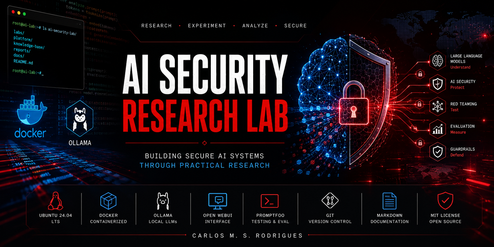
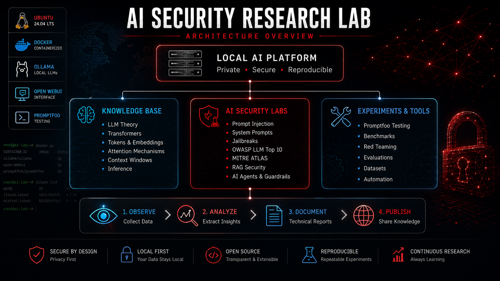
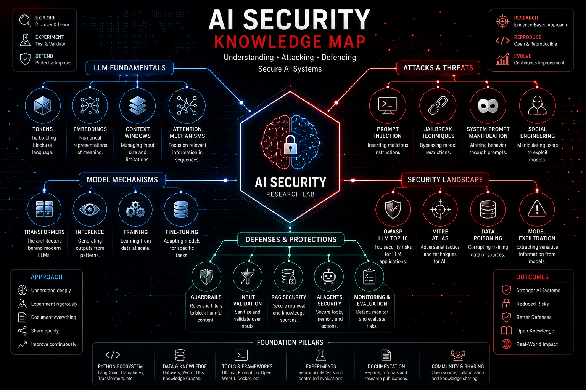
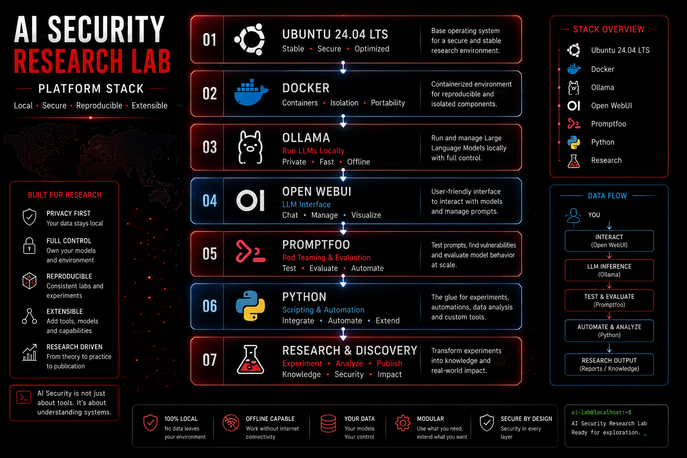
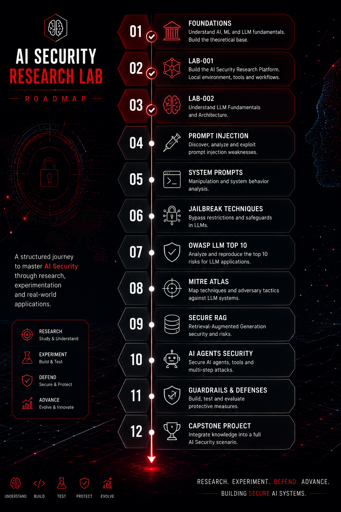

<p align="center">



</p>

<h1 align="center">AI Security Research Lab</h1>

<p align="center">

<b>Building practical AI Security expertise through research, experimentation and reproducible laboratories.</b>

</p>

<p align="center">


</p>

<p align="center">


</p>

---

# Mission

Artificial Intelligence is transforming cybersecurity at an unprecedented pace.

Large Language Models are rapidly becoming part of enterprise environments, SOC platforms, cloud services, development pipelines and security products.

Understanding **how these systems actually work** is no longer optional for security professionals.

The purpose of this repository is to investigate **AI Security Engineering** through practical laboratories, technical research and reproducible experiments, building upon a professional background in Infrastructure, Networking and Cybersecurity.

Rather than focusing only on AI security tools, this project investigates the internal mechanisms of modern Large Language Models before studying how they can be attacked, evaluated and defended.

Every laboratory is designed to be completely reproducible, allowing other professionals to follow the same learning path and build their own AI Security laboratory.

---

# Why this project is different

Many AI Security repositories focus primarily on demonstrating tools.

This project follows a different philosophy.

Before studying Prompt Injection, Jailbreaks, Guardrails or AI Red Teaming, it is essential to understand how Large Language Models generate responses.

Every laboratory follows the same research methodology:

- Study the theoretical concepts
- Build the laboratory
- Execute practical experiments
- Validate observations
- Document technical findings
- Publish reproducible results

The objective is not simply to learn AI Security, but to understand the behaviour of Large Language Models from first principles.

---

# Architecture

<p align="center">



</p>

The AI Security Research Lab is organised around four major pillars.

- **Platform** – Local AI infrastructure built with Docker, Ollama and Open WebUI.
- **Knowledge Base** – Living documentation covering LLM concepts and AI Security topics.
- **Laboratories** – Practical experiments with complete technical documentation.
- **Research** – Continuous investigation into AI attacks, defences and emerging techniques.

This modular architecture allows every laboratory to build upon the previous one while keeping the repository organised and easy to reproduce.

---

# Current Laboratories

The AI Security Research Lab is organised as a sequence of independent but interconnected laboratories.

Each laboratory introduces new concepts, validates them through practical experimentation and documents the results with technical reports, screenshots and reproducible procedures.

| Status | Laboratory | Description |
|:------:|------------|-------------|
| ✅ | **LAB-001** | AI Security Research Platform |
| ✅ | **LAB-002** | LLM Fundamentals and Architecture |
| 🔜 | **LAB-003** | Prompt Injection |
| 🔜 | **LAB-004** | System Prompts |
| 🔜 | **LAB-005** | Jailbreak Techniques |
| 🔜 | **LAB-006** | Promptfoo Security Evaluation |
| 🔜 | **LAB-007** | OWASP LLM Top 10 |
| 🔜 | **LAB-008** | MITRE ATLAS |
| 🔜 | **LAB-009** | Retrieval-Augmented Generation (RAG) Security |
| 🔜 | **LAB-010** | AI Guardrails |
| 🔜 | **LAB-011** | AI Agents Security |
| 🔜 | **LAB-012** | AI Security Capstone |

Every laboratory includes:

- Objectives
- Technical report
- Practical experiments
- Screenshots
- Lessons learned
- References
- LinkedIn publication

---

# Knowledge Base

<p align="center">



</p>

The Knowledge Base is a continuously growing collection of technical documentation that supports every laboratory.

Instead of duplicating explanations inside each lab, common concepts are documented once and continuously refined as the research evolves.

Current topics include:

- Large Language Models
- Tokens
- Tokenization
- Embeddings
- Context Windows
- Transformer Architecture
- Attention Mechanism
- Prompt Injection
- Jailbreak Techniques
- System Prompts
- Retrieval-Augmented Generation (RAG)
- Guardrails
- OWASP LLM Top 10
- MITRE ATLAS

The objective is to build a practical AI Security reference that grows together with the laboratories.

---

# Platform Stack

<p align="center">



</p>

Every experiment is executed inside a fully local AI Security laboratory.

The platform has been designed to minimise external dependencies while allowing complete control over models, prompts, datasets and evaluation tools.

Current platform components include:

- Ubuntu 24.04 LTS
- Docker
- Docker Compose
- Ollama
- Open WebUI
- Promptfoo
- Python
- Git
- GitHub

Future integrations include:

- LangChain
- LlamaIndex
- vLLM
- NVIDIA NIM
- MLflow
- Neo4j
- ChromaDB
- OpenTelemetry
- AI Red Team Frameworks

---

# Research Roadmap

<p align="center">



</p>

The laboratories are intentionally organised as a progressive learning path.

Each completed laboratory becomes the foundation for the next one.

Rather than jumping directly into Prompt Injection or AI Red Teaming, the roadmap begins with understanding how Large Language Models internally process information.

Only after mastering the fundamentals does the project move into offensive and defensive AI Security techniques.

This incremental approach ensures that every security concept is supported by a solid technical understanding of the underlying model behaviour.

---

# Repository Structure

The repository has been organised to clearly separate documentation, laboratories, platform configuration and research material.

```text
ai-security-research-lab
│
├── docs/
│   ├── adr/
│   ├── architecture/
│   ├── guides/
│   ├── images/
│   ├── references/
│   └── research/
│
├── knowledge-base/
│
├── labs/
│   ├── LAB-001-AI-Security-Research-Platform/
│   ├── LAB-002-LLM-Fundamentals-and-Architecture/
│   └── ...
│
├── platform/
│
├── reports/
│
└── README.md
```

This structure allows every laboratory to remain self-contained while sharing common documentation, platform components and AI Security knowledge.

---

# Latest Publications

Every completed laboratory is accompanied by a technical article summarising the research and the practical experiments.

| Laboratory | Publication |
|------------|-------------|
| LAB-001 | Building an AI Security Research Platform |
| LAB-002 | Understanding LLM Fundamentals and Architecture |

Future articles will continue to document the evolution of the laboratory as new AI Security topics are explored.

---

# Research Philosophy

Artificial Intelligence is evolving faster than traditional security methodologies.

Many professionals begin by learning Prompt Injection techniques, AI Red Teaming frameworks or Guardrail solutions without first understanding how Large Language Models actually generate responses.

This project follows a different philosophy.

Understanding the internal behaviour of a Large Language Model is considered a prerequisite for understanding its attack surface.

Every laboratory follows the same scientific methodology.

1. Study the theory.
2. Build the environment.
3. Perform practical experiments.
4. Validate the observations.
5. Document the technical findings.
6. Publish reproducible results.

This methodology ensures that every conclusion presented in this repository is supported by practical experimentation rather than theoretical assumptions.

The ultimate objective is not simply to learn AI Security tools, but to develop the mindset and methodology required to conduct independent AI Security research.

---

# Current Research Areas

Current and future research topics include:

- Large Language Models
- Transformer Architecture
- Prompt Engineering
- Prompt Injection
- System Prompts
- Jailbreak Techniques
- Prompt Leakage
- Promptfoo Security Evaluation
- OWASP LLM Top 10
- MITRE ATLAS
- Retrieval-Augmented Generation (RAG)
- AI Guardrails
- AI Agents Security
- AI Red Teaming
- AI Blue Teaming
- AI Incident Response
- Secure AI Architectures
- AI Governance

---

# About the Author

**Carlos M. S. Rodrigues**

Infrastructure • Networking • Cybersecurity • AI Security Research

This repository documents my ongoing transition towards AI Security Engineering through continuous research, practical experimentation and technical documentation.

Every laboratory is built, tested and validated in a fully local environment before publication.

The long-term objective is to contribute practical and reproducible research to the growing field of AI Security.

---

# Contributing

Contributions, discussions and constructive feedback are always welcome.

If you identify improvements, discover new attack techniques or wish to collaborate on AI Security research, feel free to open an Issue or submit a Pull Request.

---

# License

This project is released under the **MIT License**.

---

# Connect

If you find this repository useful, consider:

⭐ Starring the repository

🍴 Following the project

💬 Sharing feedback

🤝 Connecting with me on LinkedIn

AI Security is still an emerging discipline, and the best way to learn is by building, experimenting and sharing knowledge with the community.
