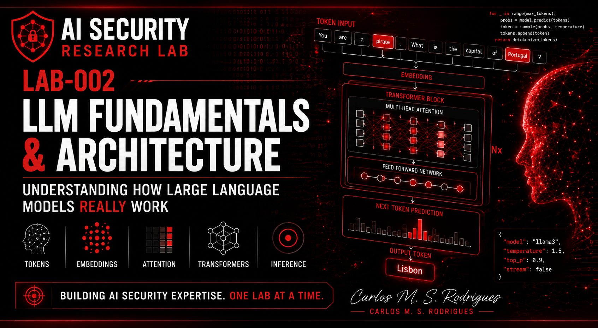

# LAB-002 — LLM Fundamentals and Architecture

  

## Status

✅ Completed — theoretical foundation, practical experiments,
technical report and LinkedIn publication completed.

## Objective

The purpose of this laboratory was to understand how Large Language
Models work internally before beginning practical AI Security attack
simulations.

Understanding the internal architecture of an LLM is essential for
later studying Prompt Injection, Jailbreaks, Prompt Leakage,
Guardrails and AI Security.

## Topics Covered

- Large Language Models
- Transformer architecture
- Tokens
- Tokenization
- Embeddings
- Context windows
- Attention mechanism
- Next-token prediction
- Inference
- Temperature

## Practical Experiments

The following experiments were performed using Ollama and Llama 3:

- Model validation
- API validation
- Prompt execution
- Context manipulation
- Temperature comparison
- Deterministic and stochastic inference comparison

## Evidence

Screenshots of the experiments are available in the
[`screenshots`](screenshots/) directory.

## Technologies

- Ubuntu 24.04 LTS
- Docker
- Ollama
- Llama 3
- Open WebUI
- curl
- jq

## Skills Acquired

After completing this laboratory, it is possible to understand:

- How LLMs process prompts
- How context influences responses
- Why Prompt Injection can work
- How inference generates text
- How temperature influences model behaviour

## Publication

- [Read the LinkedIn article](https://www.linkedin.com/pulse/understanding-how-large-language-models-really-work-lab-s-rodrigues-xgy3e/)
- [Open the publication reference](article/README.md)
- [Read the technical report](report/LAB-002-Technical-Report.md)

## Next Laboratory

[LAB-003 — Prompt Injection](../LAB-003-Prompt-Injection/README.md) ✅
